# Coordinate-Graphing-Picture-Worksheet-Generator
Drag and drop an image to trace a simple line drawing over it, edit the points, export worksheet as PDF!

### [Try It Out](https://camelcasesensitive.github.io/Coordinate-Graphing-Picture-Worksheet-Generator/)

  <a href="https://camelcasesensitive.github.io/Coordinate-Graphing-Picture-Worksheet-Generator/">
    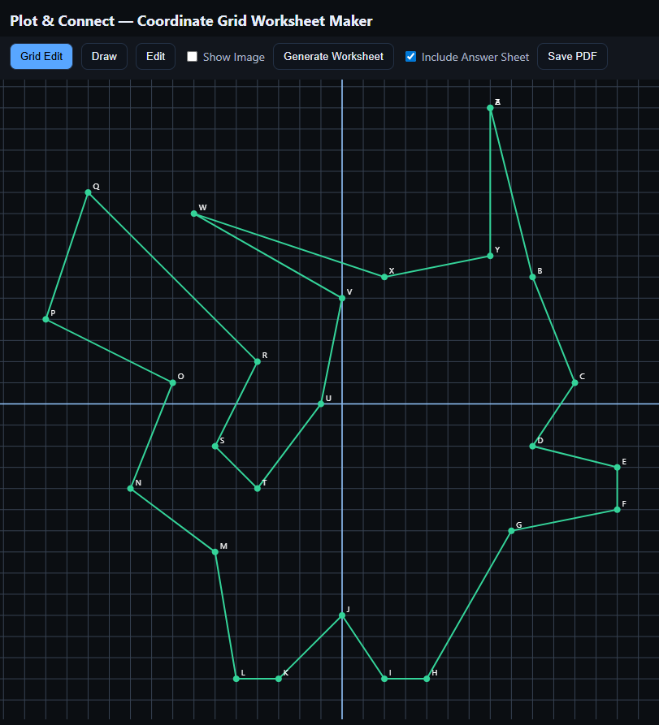
  </a>

### Example Worksheets

  <a href="https://drive.google.com/file/d/1mHtQpPDDNft6ZIu6ZF3-qxE50Z-4LGY6/view?usp=sharing" style="text-align:center;">
    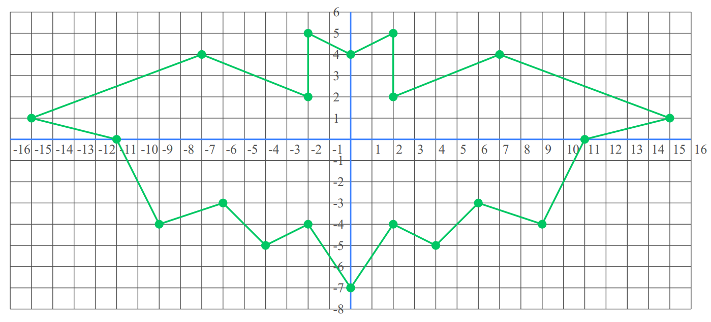
  </a>

  <a href="https://drive.google.com/file/d/17G9tAQS9MLwzqG64VvV1EeDj7I--uL5L/view?usp=sharing" style="text-align:center;">
    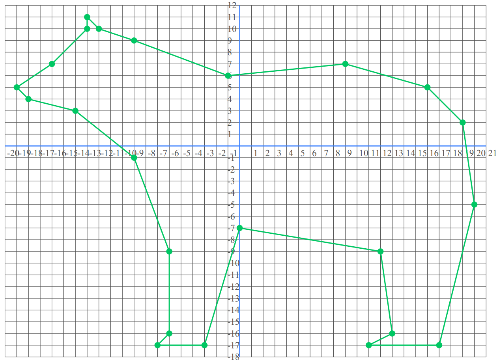
  </a>

  <a href="https://drive.google.com/file/d/1qIOTaBq9JYksEH1ZT53PqwhRuGowMWYL/view?usp=sharing" style="text-align:center;">
    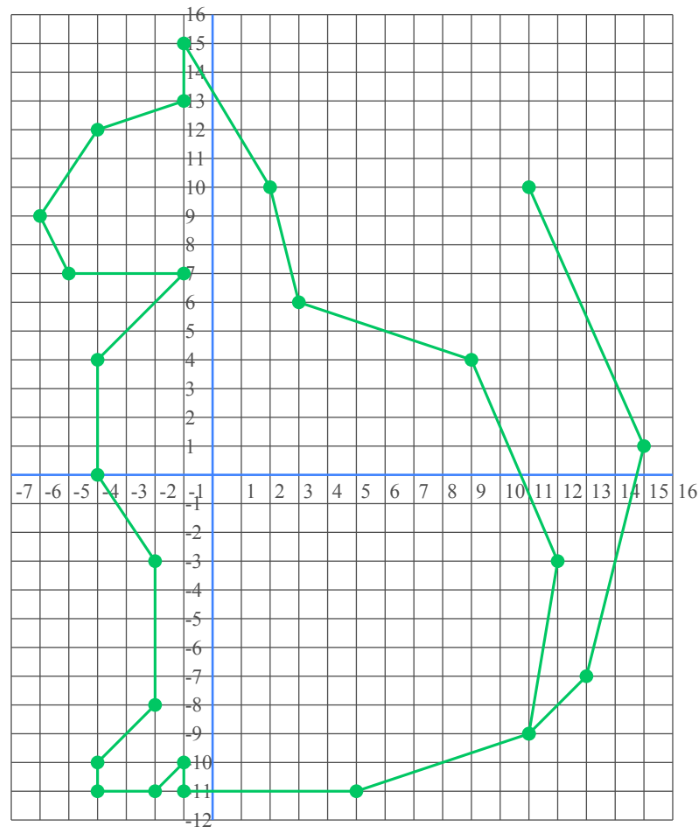
  </a>

  <a href="https://drive.google.com/file/d/1J0LXaBwMgcyHyjtb6AtSE6idWfMJi7fD/view?usp=sharing" style="text-align:center;">
    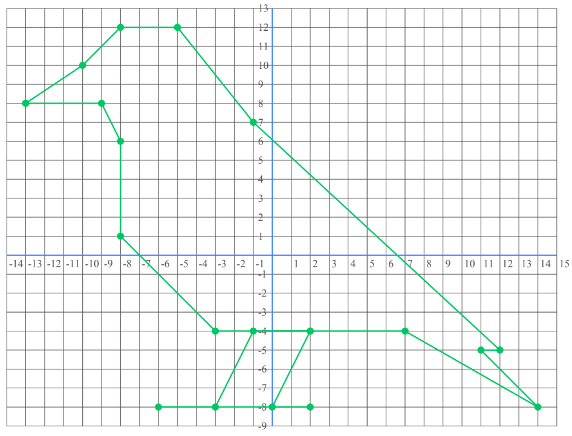
  </a>

  <a href="https://drive.google.com/file/d/1vJxM-Qg7JBb5xW5UsghvImdK2XBexQdc/view?usp=sharing" style="text-align:center;">
    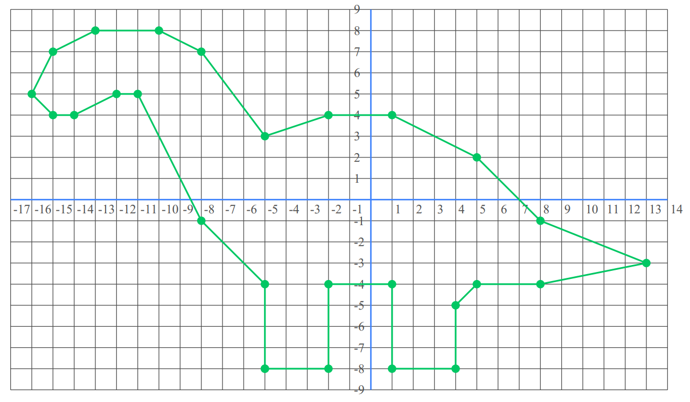
  </a>

  <a href="https://drive.google.com/file/d/10jm6_Vu1XwDhTlaDV8F5um0fTF2lSkyM/view?usp=sharing" style="text-align:center;">
    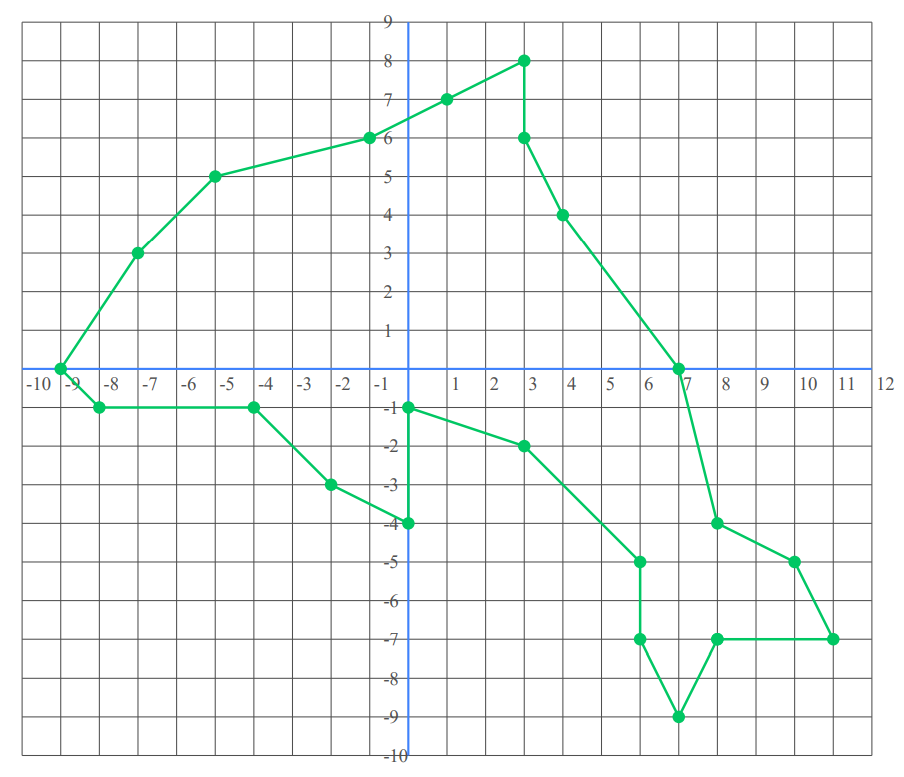
  </a>

  <a href="https://drive.google.com/file/d/1a1cerO1tzmcHSZzsoz4KS4zQEaWbLKUE/view?usp=sharing" style="text-align:center;">
    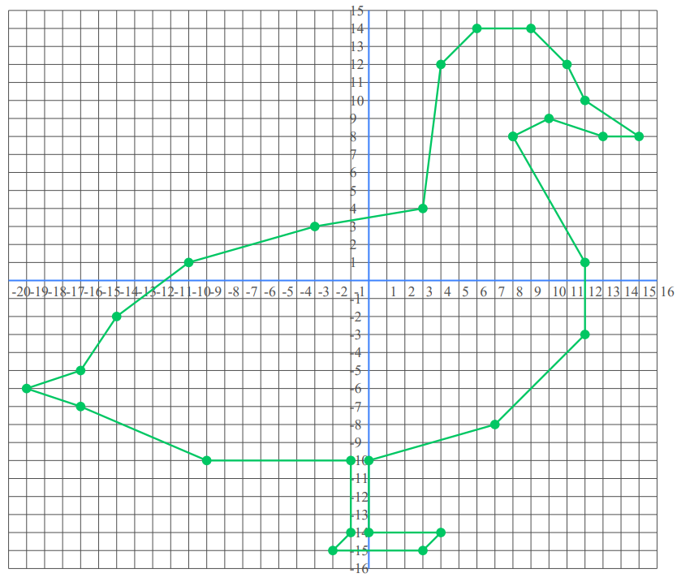
  </a>

  <a href="https://drive.google.com/file/d/1LVFn-1BoOzpT-P4QBf560Q4As2qmKJRA/view?usp=sharing" style="text-align:center;">
    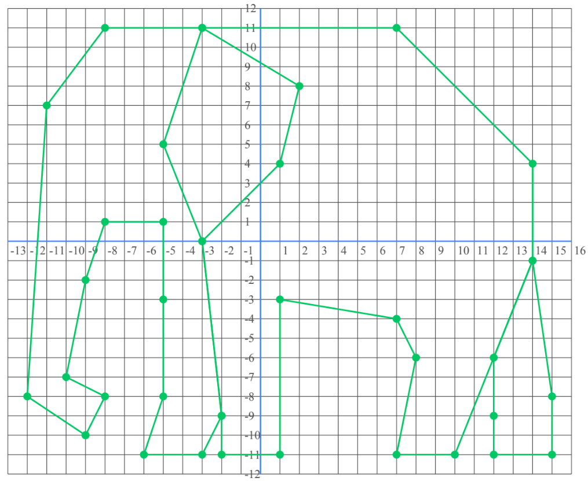
  </a>

  <a href="https://drive.google.com/file/d/1yt4fttwiM27hUOCnDNH4mIyNvvnKj_ce/view?usp=sharing" style="text-align:center;">
    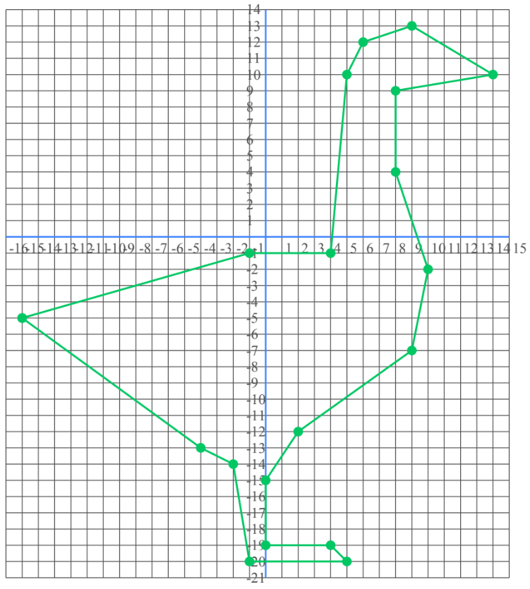
  </a>

  <a href="https://drive.google.com/file/d/1ZLfBIxTiMmQPj11Izjx5LJMIog3D9v9-/view?usp=sharing" style="text-align:center;">
    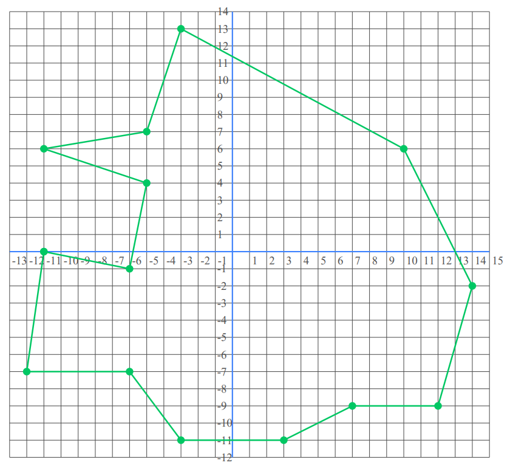
  </a>

  <a href="https://drive.google.com/file/d/19HlGtPAkK6WXpVOj9Sz9tKLUqwTq9tqy/view?usp=sharing" style="text-align:center;">
    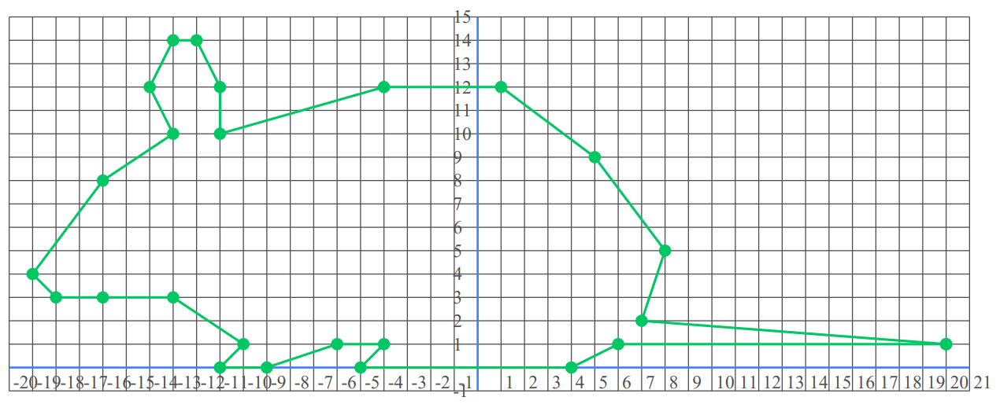
  </a>

  <a href="https://drive.google.com/file/d/1IK-YM6Kz1fLVI8kwDshuXNZguBqzUIrt/view?usp=sharing" style="text-align:center;">
    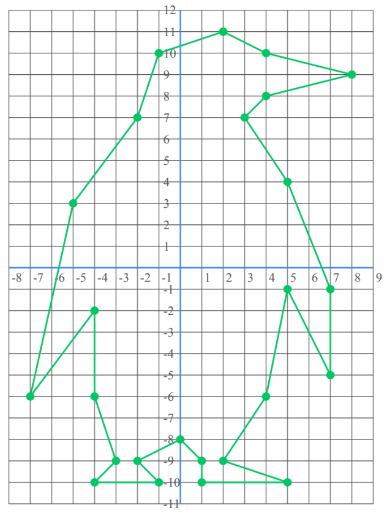
  </a>

  <a href="https://drive.google.com/file/d/1InVOTgQp7O7defDFB3DQMO3PAU-t2ph4/view?usp=sharing" style="text-align:center;">
    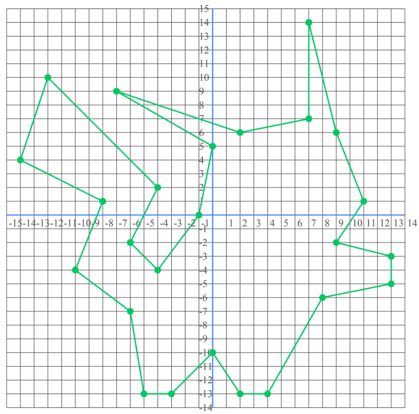
  </a>

  <a href="https://drive.google.com/file/d/1qE8pJCQANImv8i7mn4FjbCIKRCJ1UJ_S/view?usp=sharing" style="text-align:center;">
    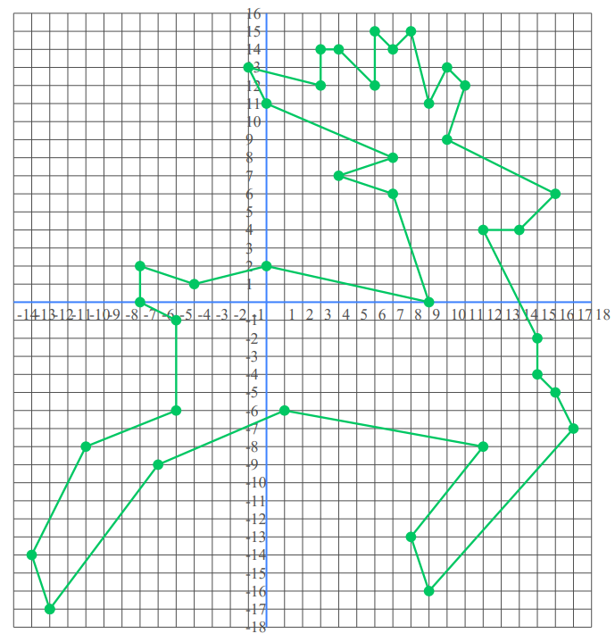
  </a>

  <a href="https://drive.google.com/file/d/1cRhIJghWPr4ZvNyYBkEE9C6AglZFRxUQ/view?usp=sharing" style="text-align:center;">
    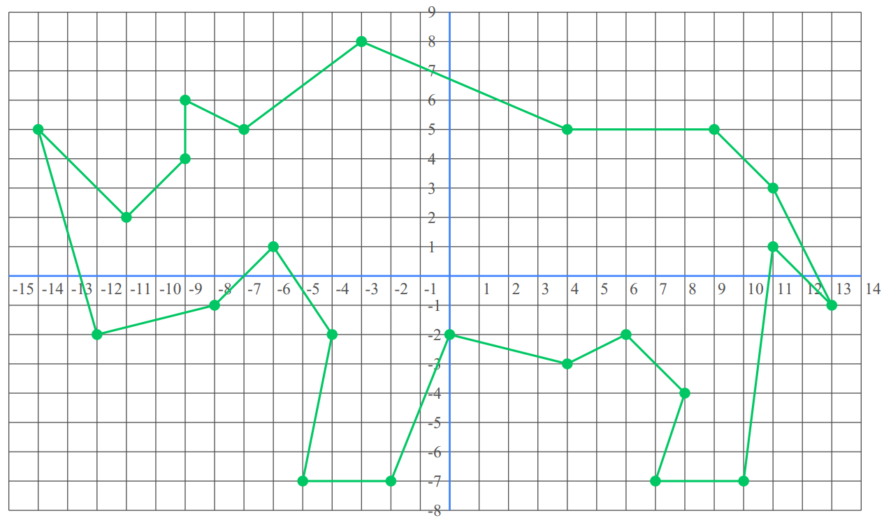
  </a>

  <a href="https://drive.google.com/file/d/1-ESMHAcqsySDgMoIUdEYR1kTNDcbFm2m/view?usp=sharing" style="text-align:center;">
    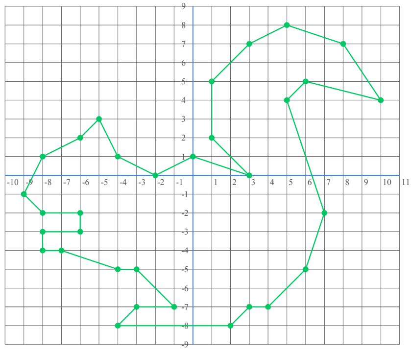
  </a>

Free browser tool for generating worksheets for practicing plotting points that generate a picture.
